# COMP90024-CCC

## Week1 - How we got here
1. What is cloud computing?
    - In 2013, Cloud computing is a jargon term without a commonly accepted non-ambiguous scientific or technical definition. (Anything that is not on your computer, e.g.: gmail)
    - In 2016, Proponents claim that cloud computing allows companies to avoid upfront infrastructure costs, and focus on projects that differentiate their businesses instead of on infrastructure. Proponents also claim that cloud computing allows enterprises to get their applications up and running faster, with improved manageability and less maintenance, and enables IT to more rapidly adjust resources to meet fluctuating and unpredictable business demand. Cloud providers typically use a "pay as you go" model. This can lead to unexpectedly high charges if administrators do not adapt to the cloud pricing model. (Everyone has different flavor)
2. Cloud Characteristics (Lecture notes and then my paraphrasing)
    - On-demand self-service
        - A consumer can provision computing capabilities as needed without requiring human   interaction with each service provider. 
        - Scale computing resources up and down by needs without requiring human interaction with each service provider.
        - For anyone in any time - infinite availability (key)
    - Networked access
        - Capabilities are available over the network and access through standard mechanisms that promote use by heterogeneous client platforms.
        - Resources can be access through network and adapted to heterogeneous client platforms.
    - Resource pooling
        - The provider's computing resources are pooled to serve multiple consumers using a   multi-tenant model potentially with different physical and virtual resources that can be  dynamically assigned and reassigned according to consumer demand. 
        - Provider’s resources are pooled and can be dynamically assigned and reassigned by need.     
        - Enough resource to scale up & down
    - Rapid Elasticity
        - Capabilities can be elastically provisioned and released, in some cases automatically, to scale rapidly upon  demand.
        - Capabilities can scale easily and rapidly upon demand.
    - Measured Service
        - Cloud systems automatically control and optimize resource use by leveraging a metering  capability at some level of abstraction appropriate to the type of service.
        - Resourcing optimization by measuring usage
        - monitor for load balance (e.g.: nigix)
3. Flavour
    - Compute clouds
      - Amazon Elastic compute cloud
      - Azure
    - Data Clouds
      - Amazon Simple Storage Service
      - Google docs
      - iCloud
      - Dropbox
    - Application Clouds
      - App store
      - Virtual image factories
    - Public(credit card and pay for using) /Private(Unimelb research cloud)/Hybrid(MRC run out of resource nad buy from Amazon)/Mobile/Health Clouds
    - complexity arise in: decision about what can we move out/what cost ot stay in/who is  allowed this to happen
4. History - tends in computing
    1. Computing and Communication Technologies (r)evolution
        - from centralised to decentralised
    2. distributed system history
        - Once upon a time we had standards
        - Then we had more standards
        - mid-90s: focused on computer-computer interaction
        - internet: peer-to-peer
            - challenge: sharing data between different organizations
            - soln: grid computing
            - Grid: only need access to it no matter it is data or super computer the process to move things
                - problem: people have different ways to do it
    - Distributed System
        - <u>**Transparency**</u> and **<u>heterogeneity</u>** in computer-computer interactions
        - Finding resources -> Binding resources -> run time type checking -> invoking resources
        - Dealing with heterogeneous of system
        - Challenges
            - Complexity of implementations
            - Vendor specific solutions
            - Scalability problem
            - Sharing data between different organizations  
    - Grid Computing
        - From computer-computer focus to organisation-organisation focus
        - Can be thought of as a distributed system with non-interactive workloads.
        - It is in contrast to the traditional notion of a supercomputer, which has many processors connected by a local high-speed computer bus instead of Ethernet.
        - Grid computing is distinguished from conventional high-performance computing systems such as cluster computing in that grid computers have each node set to perform a different task/application. Grid computers also tend to be more heterogeneous and geographically dispersed (thus not physically coupled) than cluster computers.
        - Although a single grid can be dedicated to a particular application, commonly a grid is used for a variety of purposes. Grids are often constructed with general-purpose grid middleware software libraries. Grid sizes can be quite large.
        - Challenge
            - What resources are available
            - To determine the status of resources
            - Job scheduling
            - Virtual organization support
            - Security
                - Public key infrastructure
    
5. Comparison between Grid/Cluster/Cloud Computing
    ```
    Clusters "tend" to be tightly coupled, e.g. a bunch of servers in a rack with high speed interconnects - we'll go into some details of this in week 3;  
    Grid is/was more loosely coupled resources that provided single sign-on access to distributed resources that are often hosted by different organisations;  
    Cloud = we'll get to that soon! ;o)
    ```
    - Grid computing
        - Refer to the top
    - Cluster Computing
        - Clusters tend to be tightly coupled, e.g. a bunch of servers in a rack with high speed interconnects
        - Example
            - Super computer
    - Cloud Computing
        - Refer to week 5
        - Cloud computing is a model for enabling ubiquitous, convenient, on-demand network access to a shared pool of configurable computing resources(networks, servers, storage, applications, services) that can be rapidly provisioned and released with minimal management effort or service provider interaction.


## Week2 - Domain Drivers – tour of some big data projects
1. compute scaling
    - method:
        1. Vertical Computational Scaling
            - Have faster processors
            - disabv: processor speed is limited  
              Moore's law is no longer working, CPU stop goes faster as we expected
        2. Horizontal Computational Scaling
            - Have more processors
            - adv: 
                - 1) Easy to **add more** (more cores or cluster of nodes)
                    - add more = 
                        - Single machine multiple cores
                            - Typical laptop/PC/server these days
                        - Loosely coupled collection/cluster of machines
                            - Polling/sharing of resources
                            - Dedicated vs available only when not in use by others
                        - Tightly coupled cluster of machines
                            - Typical HPC/HTC set-up (SPARTAN)
                            - Which many servers in same room, often with fast message passing interconnects
                        - Widely distributed clusters of machines
                            - UK NGS, EGEE
                        - Hybrid combination of the above
                            - Leads to many challenges with distributed systems
                            - Shared state
                            - Delayed and lost in message passing
                - 2) cost increase not so much
            - disadv: 
                - 1) **add more** limition (see week3 - Amdahl's law)
                - 2) harder to design, develop, test
2. network scaling
    - volume of data on network grows each year
3. massive amount of data generated among a time requires compute infrasture
    - e.g. mapping the sky with data from tele-scope
5. Cloud Computing in Different Domains
    - **High energy physics**
    - Astrophysics
    - **Macro-micro simulations**
    - Electronics
    - Arts and humanities
    - Life sciences
    - Social sciences
        - Aurin
    - Clinical sciences
    - Data sharing and ethics
    - **e-Health**
        - **Security**
    - environmental
    - social
    - geographical
    - Genome
5. challenges are shaping the technological landscape
    - Challenges happen in multiple perspectives in research domains. - Big data - Big compute - Big distribution - Big collaboration - Big security
    - Tools, technologies and methodologies have been/can/are evolving to tackle these challenges
        - That there is a huge amount of work still to be done 
        - Domain knowledge is also required

## Week3 - Overview of Distributed and Parallel Computing Systems
1. Question: If n processors (cores) are thrown at a problem how much faster will it go?
    - Some terminology:
        - 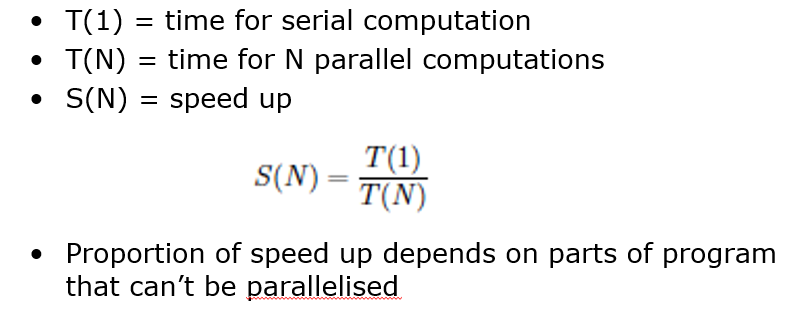
        - Proportion of speed up depends on parts of program that cannot be parallelised
    1. Amdahl's law
        - assumes a fixed problem size – sometimes can’t predict length of time required for jobs, 
            - e.g. state space exploration or differential equations that don’t solve
        - 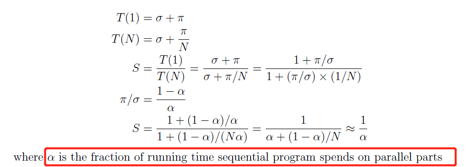
        - That is, if 95% of the program can be parallelized, the theoretical maximum speedup using parallel computing would be 20 times, no matter how many processors are used.
        - If the non-parallelisable part takes 1H, then no matter how many cores are used, it won’t complete in < 1H
        - Amdahl’s Law greatly simplifies the real world
    2. Gustafson-Barsis's Law
        - speedup is a linear formula dependent on the number of processes and the fraction of time to run sequential parts
        - 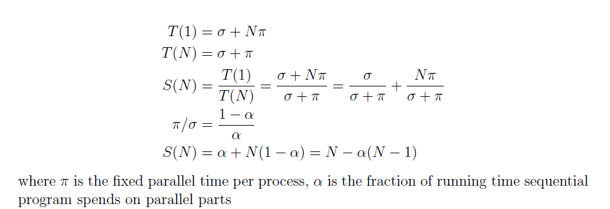
        - Faster (more parallel) equipment available, larger problems can be solved in the same time.
    3. comparison
        - Amdahl’s Law suggests that with limited task, speed up could not be too fast. 
        - Gustafson-Barsis’s Law suggests that with enough processors and remaining tasks, speed up will always meet the requirement.
3. Computer Architecture
    - At the simplest level a computer comprises:
        - CPU for executing programs
        - Memory that stores/executing programs and related data
        - I/O systems
            - keyboards, networks
        - Permanent storage for read/writing data into out of memory
        - HPC needs to keep balance of these
            - Based on the problem needs to be solved
    - There are many different ways to design/architect computers
        - different flavours suitable to different problems (below)
            |               | Simple Instruction | Multiple Instruction |
            | ------------- | ------------------ | -------------------- |
            | Single Data   | SISD               | MISD                 |
            | Multiple Data | SIMD               | MIMD                 |
            - Single Instruction, Single Data Stream (SISD)
              - Sequential computer which exploits no parallelism in either the instruction of data streams
              - Single control unit fetches single instruction stream from memory. The CU/CPU then generates appropriate control signals to direct single processing element to operate on single Data Stream, i.e. one operation at a time.
              - Example
                - von Neumann computer
            - Multiple Instruction, Single Data stream (MISD)
              - <u>**Parallel**</u> computing architecture where many functional units (PU/CPU) perform different operations on the same data
              - Example 
                - fault tolerant computer architectures: multiple error checking on the same date source
            - Single Instruction, Multiple Data Stream (SIMD)
              - Multiple processing elements that perform the same operation on multiple data points simultaneously
              - Focusing on data level parallelism: many parallel computations, but only a single process (instruction) at a given moment (<u>**Concurrency**</u>)
              - Example
                - to improve performance of multimedia use such as for image processing
            - Multiple Instruction, Multiple Data stream (MIMD)
              - Number of processors that function **asynchronously** and independently.
              - at any time, different processors may be executing different instructions on different pieces of data
              - Machines can be shared memory or distributed memory categories.
                - Depends on how MIMD processors access memory
              - Example
                - HPC
3. Approaches for Parallelism (Where and how)
    - Explicit vs Implicit Parallelisation
        - Implicit Parallelism
            - **<u>Compiler</u>** is responsible for identifying parallelism and scheduling of calculations and the placement of data
            - Disadv: Pretty hard to do
        - Explicit Parallelisation
            - **<u>Programmer</u>** is responsible for most of the parallelization effort
    - Hardware
        - Hardware Parallelisation
            - **Cache**: much faster than reading/writing to main memory; instruction cache, data cache (multi-level) and translation lookaside buffer used for virtual-physical address translation (more later on Cloud and hypervisors). 
            - **Add CPU (parallelisation)**: Parallelisation by adding extra CPU to allow more instructions to be processed per cycle. Usually shares arithmetic units. 
                - Disadv: Heavy use of one type of computation can tie up all the available units of the CPU preventing other threads from using them.
            - **Multiple cores**: Multiple cores that can process data and perform computational tasks in parallel.
                - Disadv: Typically share same cache, but issue of cache read/write performance and cache coherence. 
                - Disadv: Possibility of cache stalls (CPU not doing anything whilst waiting for caching)
                    - To address the issue that CPU not doing anything whilst waiting for caching. Many chips have mixture cache L1 for single core, L2 for pair cores and L3 shared with all cores.
                - Disadv: typical to have different cache speeds and cache sizes (higher hit rates but potentially higher latency). 
        - Symmetric Multiprocessing (SMP)
            - Two (or more) identical processors connected to a single, shared main memory, with full access to all I/O devices, controlled by a single OS instance that treats all processors equally. Each processor executes different programs and works on different data but with capability of sharing common resources (memory, I/O device, …). Processors can be connected in a variety of ways: buses, crossbar switches, meshes.  
                - Disadv: More complex to program since need to program both for CPU and inter-processor communication (bus).
        - Non-Uniform Memory Access (NUMA)
            - provides speed-up by allowing a processor to access its own local memory faster than non-local memory.
                - Disadv: Improved performance as long as data are localized to specific processes/processors. 
                - Key is allocating memory/processors in NUMA friendly ways, 
                    - e.g. to avoid scheduling/locking and (expensive) inter-processor communication. Approaches such as ccNUMA with range of cache coherency protocols/products. 
    - Operating System
      - parallel vs interleaved semantics 
        - Most modern multi-core operating systems support different "forms" of parallelisation
        - e.g.: A || B vs A ||| B
      - Compute parallelism
        - Processes
          - Used to realize tasks, structure activities
        - Theads
          - Native threads
            - Fork, Spawn, Join
          - Green threads
            - Scheduled by a VM instead of natively by the OS
      - Data parallelism
        - Caching
    - Software/Applications
      - Programming language supports a range of parallelisation/concurrency features
        - Threads, thread pools, locks, semaphores ...
      - Programming languages developed specifically for parallel/concurrent systems
      - Key issues:
        - Deadlock
          - Processes involved constantly waiting for each other
        - LiveLock
          - Process constantly change with regard to one another, but none are progressing
    - Message Passing Interface (MPI)
        - Widely adopted approach for message passing in parallel systems
        - Supports point-point, broadcast communications
        - Key MPI functions
            - ```
                MPI_Init	:initiate MPI computation
                MPI_Finalize	:terminate computation
                MPI_COMM_SIZE	:determine number of processors
                MPI_COMM_RANK	:determine my process identifier
                MPI_SEND	:send a message
                MPI_RECV	:receive a message
                ```
        - Adv: 
            - Standardised, widely adopted, portable, performant
            - Parallelisation = users problem (user controll how to parallel)
    - (HT) Condor
        - A specialized workload management system for compute-intensive jobs developed at University of Wisconsin
        - Adv:
            - Offers job queueing mechanisms, scheduling policies, priority schemes, resource monitoring/management
            - User submits jobs to Condor and it chooses when and where to run the jobs, monitors their progress, and informs the user upon completion 
            - Allows to harvest “free” (?) CPU power from otherwise idle desktop workstations
                - e.g. use desktop machines when keyboard and mouse are idle 
                    - key press detected checkpoint and migrate a job to a different (idle) machine 
            - No need for shared file system across machines
                - Data can be staged to machines as/when needed
            - Can work across organisational boundaries
                - Condor Flocking
            - ClassAds
                - Advertise resources and accept jobs (according to policy)
    - Data Parallelism Approaches (week 9)
        - Challenges of big data
            - The most important kind of parallelism challenge?
        - Distributed data
            - CAP Theorem: Consistency, Availability, Partition tolerance
            - ACID <-> BASE
        - Distributed File Systems 
            - e.g. Hadoop, Lustre, Ceph…
4. Erroneous Assumptions of Distributed Systems (detail see slides)
    - Challenges with Distribution 
        - "A distributed system is one in which the failure of a computer you didn't even know existed can render your own computer unusable" by Leslie Lamport
    - The network is reliable
    - Latency is zero
    - Bandwidth is infinite - I can send any amount of data I wish between any nodes
    - The network is secure
        - People sending data to my services
            - Repeated password attempts, SQL injections, …!?
        - People actively attacking me
            - Distributed denial of service attacks
        - People reading the data sent over the network
            - Man in the middle attacks
        - People masquerading as one of my nodes
            - Spoofing 
        - People breaking into one of my nodes
            - Trojans, viruses, brute force attacks, …
        - People stealing the physical hardware
    - Topology doesn't change - Node x is always there
    - There is one administrator
        - e.g.: Firewall changes, server reconfigurations, services, access control (students/staff/others…)
    - Transport cost is zero - I can send as much data as I like for free
    - The network is homogeneous
    - Time is ubiquitous - Clock is same across all computers in network
    - [-- Assumption ends --]
    - issues of heterogeneity of compute, data, security from lecture 1
    - Distributed systems are widespread - The Internet
    - Many approaches to design parallel or distributed systems (below)
        - No single algorithm
        - No single technical solution
        - Eco-system of approaches explored over time and many open research questions/challenges
        - Flavour of some of these…
5. Strategies for Development of Parallel/Distributed Systems
    - strategies: (detail see slides)
        - Automatic parallelization
        - Parallel libraries
        - Major recording
    - Challenges:
        - dependence analysis is hard for code that uses pointers, recursion, …; 
        - loops can have unknown number of iterations; 
        - access to global resources, e.g. shared variables
6. Design Stages of Parallel Programs
    - Partitioning
        - Decomposition of computational activities and data into smaller tasks 
        - Numerous Pprallelisation paradigms:
            - Master-Worker/task-farming
                - Master decomposes the problem into small tasks
                - distributes to workers and gathers partial results to produce the result
                - Master-worker/task-farming is like divide and conquer with master doing both split and join operation
                - 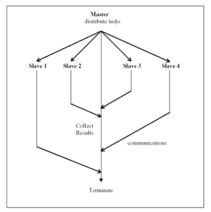
            - Divide and Conquer
                - 1) A problem is divided into two or more sub problems
                - 2) each of these sub problems are solved independently
                - 3) their results are combined
                - 3 operations: split, compute, and join
                - Master-worker/task-farming is like divide and conquer with master doing both split and join operation
                - 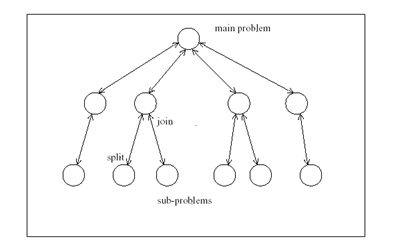
            - Single-Program Multiple-Data (SPMD)
                - Each process executes the same piece of code, but on different parts of the data
                - Data is typically split among the available processors
                - Data splitting and analysis can be done in many ways
                - Commonly exploited model: MapReduce
                - 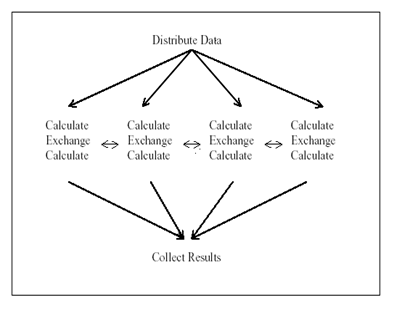
            - Pipelining 
                - Suitable for applications involving multiple stages of execution
                - typically operate on large number of data sets.
                - 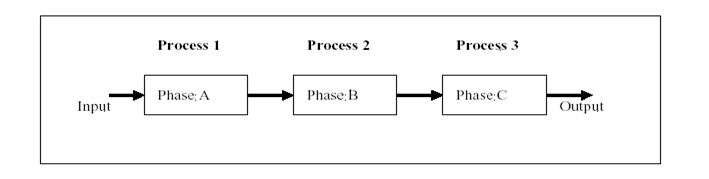
            - Speculation
                - Used when it is quite difficult to achieve parallelism through the previous paradigms
                - use "look ahead" execution
                    - Like look ahead, if the data is predictable, we could use the predicted data to do the following action while waiting for data.
                    - If the prediction is incorrect, we have to take corrective action.
                - procedure: 
                    - Consider a (long running) producer P and a consumer C such that C depends on P for the value of some variable V. If the value of V is *predictable*, we can execute C speculatively using a predicted value in parallel with P.
                        - If the prediction turns out to be correct, we gain performance since C doesn’t wait for P anymore. 
                        - If the prediction is incorrect (which we can find out when P completes), we have to take corrective action, cancel C and restart C with the right value of V again. 
            - Parametric Computation
                - not discussed?
        -  Communication (relates with MPI)
            - Flow of information and coordination among tasks that are created in the partition stage
        -  Agglomeration
            - (performance measuring) Tasks and communication created in above stages are evaluated for performance and implementation cost
            - Tasks may be grouped into larger tasks to improve communication
            - Individual communications can be bundled
        -  Mapping/Scheduling
            - (design to be able to scale up/down) Assign tasks to processors such that job completion time is minimized and resource utilization is maximized

## Week4 - The Spartan HPC System
- Some background on supercomputing, high performance computing, parallel computing, research computing (they're not the same thing!).
    - Supercomputer
        - Any single computer system that has exceptional processing power for its time.
    - Clustered computing
        - is when two or more computers serve a single resource 
            - e.g.: A collection of smaller computers strapped together with a high-speed local network
        - Adv: improves performance and provides redundancy;
    - HPC - high performance computing
        - It is any computer system whose architecture allows for above average performance
        - The clustered HPC is the most efficient, economical, and scalable method, and for that reason it **dominates supercomputing**.
    - Parallel and Research Programming
        - Parallel computing refers to the submission of jobs or processes over multiple processors and by splitting up the data or tasks between them
            - With a cluster architecture, applications can be more easily parallelised across them.
        - Research computing is the software applications used by a research community to aid research.
            - challenge: This skills gap is a major problem and must be addressed because as the volume, velocity, and variety of datasets increases then researchers will need to be able to process this data.
2. Flynn’s Taxonomy and Multicore System
    - Over time computing systems have moved towards multi-processor, multi-core, and often multi-threaded and multi-node systems.
    - As computing technology has moved increasingly to the MIMD taxonomic classification additional categories have been added:
        - Single program, multiple data streams (SPMD)
        - Multiple program, multiple data streams (MPMD)
3. Things are more important than performance
    - Correctness of code and signal
    - Clarity of code and architecture
    - Reliability of code and equipment
    - Modularity of code and components
    - Readability of code and hardware documentation
    - Compatibility of code and hardware
- Why performance and scale matters, and why it should matter to you.
- An introduction to Spartan, University of Melbourne's HPC/cloud hybrid system
- Logging in, help, and environment modules.
- Job submission with Slurm workload manager; simple submissions, multicore, multi-node, job arrays, job dependencies, interactive jobs.
- Parallel programming with shared memory and threads (OpenMP) and distributed memory and message passing (OpenMPI)
- Tantalising hints about more advanced material on message passing routines.

## Week5 - Cloud Computing & ~~Getting to Grips with the University of Melbourne Research Cloud~~
Cloud computing is a model for enabling ubiquitous, convenient, on-demand network access to a shared pool of configurable computing resources (e.g., networks, servers, storage, applications, and services) <u>that can be rapidly provisioned and released with minimal management effort or service provider interaction</u> 可以通过最少的管理工作或服务提供者交互从而可以快速地配置和发布
- 
1. Deployment Models

    || Private| Community| Public| Hybrid |
    |---|---|---|---|---|
    |pro|1. **Control**<br>2. **Consolidation of resources**<br>3. **Easier to secure** - easy to setup firewall<br>4. **More trust**||1. Utility computing<br>2. **Can focus on core business** - no need to care infrasture or be a devop<br>3. Cost-effective - use as much as you need<br>4. “Right-sizing”<br>5. Democratisation of computing<br>|1. **Cloud-bursting** - Use private cloud, but burst into (突然变成) public cloud when needed |
    |con|1. Relevance to core business?<br>e.g. Netflix to Amazon<br>2. Staff/management overheads - need devop<br>3. Hardware obsolescence - need to refesh hardware<br>4. Over/under utilisation challenges - recycle resources<br>| | 1. **Security** - people can see your sensitive data<br>2. Loss of control<br>3. **Possible lock-in** - difficult to switch Azure if using AWS<br>4. Dependency of Cloud provider continued existence<br>| 1. How do you move data/resources when needed?<br>2. How to decide (in real time?) what data can go to public cloud?<br>3. Is the public cloud compliant with PCI-DSS (Payment Card Industry – Data Security Standard)?<br>|
    |example| | | | Eucalyptus, VMWare vCloud Hybrid Service|

2. Delivery Models
- responsibilities:
    - 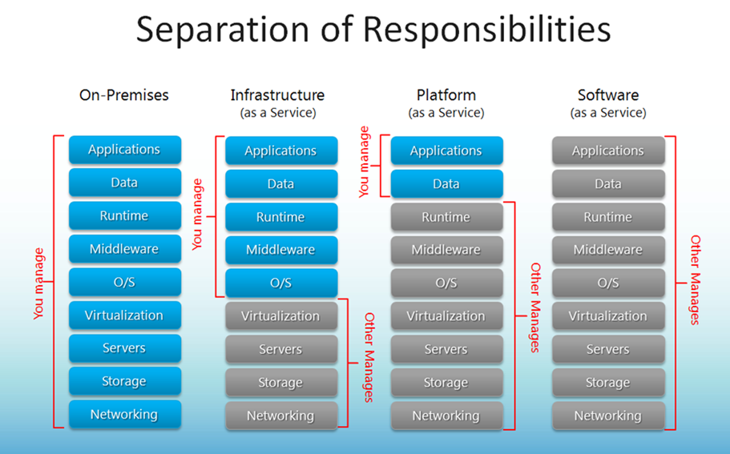
-
    | | Iaas| Paas|Saas|
    |---|---|---|---|
    | example| Amazon Web Services<br>Oracle Public Cloud<br>NeCTAR| Azure| Gmail|

## Workshop week5: Auto-Deployment -- Ansible
- Reason for auto-deployment (**comparison**)
  - We are easy to forget what software we installed, and what steps we took to configure the system
  - Manual process is error-prone, can be non-repeatable
  - Snapshots are monolithic
    - provide no record of what has changed
  - Manual deployment provides no record of what has changed
- Automation is the mechanism used to make servers reach a desirable state.
  - Automation provides (**advantages**)
    - A record of what you did
    - Knowledge about the system in code
    - Making the process repeatable
    - Making the process programmable
    - Infrastructure as Code
- Configuration management (CM) tools
    - Configuration management refers to the process of systematically handling changes to a system in a way that it maintains integrity over time.
- Ansible is an automation tool for configuring and managing computers.
  - Features about ansible (Pros)
    - Easy to learn
      - Playbooks in YAML, templates in Jinja2
      - Sequential execution
    - Minimal requirements
      - No need for centralized management servers/daemons
      - Single command to install
      - Using SSH to connect to target machine
    - Idempotent
      - Executing N times no different to executing once
      - Prevents side-effects from re-running scripts
    - Extensible
      - Write you own modules
    - Rolling updates
      - Useful for continuous deployment/zero downtime deployment
    - Inventory management
      - Dynamic inventory from external data sources
      - Execute tasks against host patterns
    - Ansible Vault for encryption

## Week 6 – Web Services, ReST Services ~~and Twitter demo~~

### SOA

1. What's in an Architecture?
    - A (system) architecture is just the way different components are distributed on computers, 
    - and the way in which they interact with each other.
2. Why Service-oriented Architectures - SOA?
    - When an architecture is completely contained within the same machine, components can communicate directly
        - e.g. through function calls or object instantiations.
    - However, when components are distributed such a direct approach typically cannot be used  (e.g. Assignment 2!)
    - Therefore, components (more properly, systems) have to interact in more loosely-coupled ways. 
    - **Services** are often used for this. Typically combinations and commonality of services can be used to form a **Service-oriented Architecture (SoA)**.
3. SOA goal

    |||
    |---|---|
    |A set of externally facing services|that a business wants to provide to external collaborators|
    |An architectural pattern|based on service providers, one or more brokers, and service requestors based on agreed service descriptions|
    |A set of architectural principles, patterns and criteria|that support modularity, encapsulation, loose coupling, separation of concerns, reuse and composability|
    |A programming model|complete with standards, tools and technologies that supports development and support of services (note that there can be many flavours of services)|
    |A middleware solution|optimized for service assembly, orchestration, monitoring, and management (Can include tools and approaches that combine services together.)<br/>e.g. as workflows. - later on security lecture|

4. SOA design principle

    |||exmaple|
    |---|---|---|
    |Standardized service contract| Services adhere to a communications agreement, as defined collectively by one or more service-description documents.|Use defined twitter API|
    |Service loose coupling| Services maintain a relationship that minimizes dependencies and only requires that they maintain an awareness of each other.|
    |Service abstraction| Beyond descriptions in the service contract, services hide logic from the outside world.|Twitter decide the API for you to use i.e. the rule how you can see inside through the Twitter, hide things which you have no access to
    |Service reusability| Logic is divided into services with the intention of promoting reuse.|
    |Service autonomy| Services have control over the logic they encapsulate.|you can have tweets older than 2 weeks than you really can't
    |Service statelessness| Services minimize resource consumption by deferring the management of state information when necessary.|
    |Service discoverability| Services are supplemented with communicative meta data by which they can be effectively discovered and interpreted.|
    |Service composability| Services are effective composition participants, regardless of the size and complexity of the composition.|
    |Service granularity| a design consideration to provide optimal scope at the right granular level of the business functionality in a service operation.|
    |Service normalization| services are decomposed and/or consolidated to a level that minimizes redundancy, for performance optimization, access, and aggregation.|
    |Service optimization| high-quality services that serve specific functions are generally preferable to general purpose low-quality ones.|
    |Service relevance| functionality is presented at a level of granularity recognized by the user as a meaningful service.|
    |Service encapsulation| many services are consolidated for use under a SOA and their inner workings hidden.|
    |Service location transparency| the ability of a service consumer to invoke a service regardless of its actual location in the network.|client only use url to use the service on the web regardless of location of service

### Web Services
1. Web Services & SOA
    - Web Services = SOA for the Web
    - Both use HTTP, hence can run over the web (although SOAP/WS often run over other protocols as well)
    - Web services used to implement SOA
2. Web Services flavor
    - (main focus of the lecture) SOAP-based Web Services
    - (main focus of the lecture) ReST-based Web Services
        - Both flavours to call services over HTTP
    - Geospatial services (WFS, WMS, WPS…)
    - Health services (HL7)
    - SDMX (Statistical Data Markup eXchange)
        - approach the statistical data around the world
3. SOAP/WS v.s. ReST  
    SOAP (Simple Object Access Protocol)

    |ReST|SOAP/WS|
    |---|---|
    is centered around resources, and the way they can be manipulated (added, deleted, etc.) remotely|built upon the <u>Remote Procedure Call paradigm (a language independent function call that spans another system)</u>|
    |Actually ReST is more of a style to use HTTP than a separate protocol|while SOAP/WS is a stack of protocols that covers every aspect of using a remote service, from service discovery, to service description, to the actual request/response|
4. How to describes the functionality offered by a web service?
    - WSDL: is an XML-based interface description language that describes the functionality offered by a web service.
    - WSDL provides a machine-readable description of how the service can be called, what parameters it expects, and what results/data structures it returns:
        - Definition – what it does 
        - Target Namespace – context for naming things
        - Data Types – simple/complex data structures inputs/outputs
        - Messages – messages and structures exchanged between client and server
        - Port Type - encapsulate input/output messages into one logical operation
        - Bindings - bind the operation to the particular port type
        - Service - name given to the web service itself

### ReST-based Web Services
1. What is ReST?  
Representational State Transfer (ReST) is intended to evoke an image of how a well-designed Web application behaves: a network of web pages (a virtual state-machine), where the user progresses through an application by selecting links (state transitions), resulting in the next page (representing the next state of the application) being transferred to the user and rendered for their use.
2. How it works?
    - 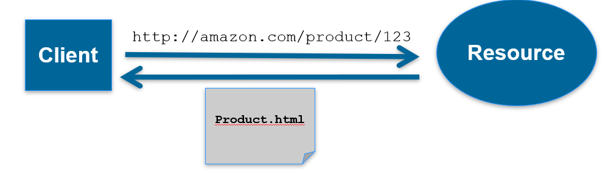
    - Client wants to access a service (Amazon) a product and things come back
        ```
        1. Clients requests Resource through Identifier (URL)
        2. Server/proxy sends representation of Resource 
        3. This puts the client in a certain state. 
        4. Representation contains URLs allowing navigation.
        5. Client follows URL to fetch another resource.
        6. This transitions client into yet another state.
        7. Representational State Transfer!
        ```
3. ReST Best Practices (principle)
    - Keep your URIs short – and create URIs that don’t change.
    - URIs should be opaque identifiers that are meant to be discovered by following hyperlinks, not constructed by the client.
    - Use nouns, not verbs in URLs
    - Make all HTTP GETs side-effect free.  Doing so makes the request "safe".
    - Use links in your responses to requests!  Doing so connects your response with other data.  It enables client applications to be "self-propelled".  That is, the response itself contains info about "what's the next step to take".  Contrast this to responses that do not contain links.  Thus, the decision of "what's the next step to take" must be made out-of-band.
    - Minimize the use of query strings.  
        - For example:
            - Prefer: http://www.amazon.com/products/AXFC
            - Over: http://www.amazon.com/products?product-id=AXFC
    - Use HTTP status codes to convey errors/success
    - In general, keep the REST principles in mind. 
        - In particular:
            - Addressability (discussed above about address design)
            - Uniform Interface (below)
            - Resources and Representations instead of RPC (below Resource section)
            - HATEOAS (below)
4. ReST – Uniform Interface
    - Uniform Interface has four more constrains:
        - Identification of Resources
            - All important resources are identified by one (uniform) resource identifier mechanism (e.g. HTTP URL)
        - Manipulation of Resources through representations
            - Each resource can have one or more representations. Such as application/xml, application/json, text/html, etc. Clients and servers negotiate to select representation.
        - Self-descriptive messages
            - Requests and responses contain not only data but additional headers describing how the content should be handled.
            - (HTTP GET, HEAD, OPTIONS, PUT, POST, DELETE, CONNECTION, TRACE, PATCH): eneryone knows what these means, no need to google the document (one advantage over SOAP)
        - HATEOAS: Hyper Media as the Engine of Application State
            - Resource representations contain links to identified resources
            - Resources and state can be used by navigating links
                - links make interconnected resources navigable
                - without navigation, identifying new resources is service-specific
            - RESTful applications **<u>navigate</u>** instead of **<u>calling</u>**
                - Representations contain information about possible traversals
                - application navigates to the next resource depending on link semantics
                - navigation can be delegated since all links use identifiers
            - Making Resources Navigable
                - RPC-oriented systems need to expose the available functions
                    - functions are essential for interacting with a service
                    - introspection or interface descriptions make functions discoverable
                - ReSTful systems use a Uniform Interface
                    - no need to learn about functions
                    - To find resources
                        - find them by following links from other resources
                        - learn about them by using URI Templates
                        - understand them by recognizing representations

4. Resource  
    - is anything that’s important enough to be referenced as a thing in itself.
    - e.g.: 
        ```
        If your users might
        - want to create a hypertext link to it
        - make or refute assertions about it
        - retrieve or cache a representation of it
        - include all or part of it by reference into another representation
        - annotate it
        - or perform other operations on it
                    ...then you should make it a resource.
        ```
3. Resource-Oriented Architecture (ROA)
    - what is it?
        - is a way of turning a problem into a RESTful web service:   
    an arrangement of URIs, HTTP, and XML that works like the rest of the Web
        - ROA has a style of supporting Restful services that allows folk to interact/navigate their functionality (HATEOS etc). The services still do PUT, POST, GET etc.
    - ROA \& Rest
        - ROA has a style of supporting Restful services that allows folk to interact/navigate their functionality (HATEOS etc). The services still do PUT, POST, GET etc.
    - ROA v.s. SOA
        - similar
            - Much of the philosophy behind SOA applies to ROA, 
                - e.g. services should support abstraction, contract, autonomy etc, 
        - ROA has advantages
            - there is no need to understand what methods mean or deal with complex WSDL etc. You can mix/match service models
                - e.g. consider the AURIN architecture with ReST, SOAP and many other service flavours.
    - ROA procedure
        - ```
            1. Figure out the data set 
            2. Split the data set into resources and for each kind of resource 
            3. Name the resources with URIs 
            4. Expose a subset of the uniform interface 
            5. Design the representation(s) accepted from the client 
            6. Design the representation(s) served to the client 
            7. Integrate this resource into existing resources, using hypermedia links and forms 
            8. Consider the typical course of events: what’s supposed to happen? - How would a user interact with it?
            9. Consider error conditions: what might go wrong?
            ```
    -  ROA actions
        - |      Action       |               HTTP METHOD                |
            | :---------------: | :--------------------------------------: |
            |  Create Resource  | PUT to a new URI POST to an existing URI |
            | Retrieve Resource |                   GET                    |
            |  Update Resource  |         POST to an existing URI          |
            |  Delete Resource  |                  DELETE                  |
        - Don't mapping PUT to Update and POST to create
            - **PUT** should be used when target resource URL is known by the client.
            - **POST** should be used when target resource URL is server generated
7. HTTP Methods can be 
    - **Safe**
        - Do not change, repeating a call is equivalent to not making a call at all 
        - GET , OPTION, HEAD
    -  **Idempotent**
        - Effect of repeating a call is equivalent to making a single call; if not can has side-effects
        - *PUT*, *DELETE*
    - **Neither**
        - POST

## Workshop week6: Containerization and docker
### Virtualization vs Containerization
- Virtualization
  - Pros
    - Application containment
    - Horizontal scalability
  - Cons
    - The guest OS and binaries can give rise to duplications between VMs wasting server processors, memory and disk space and limiting the number of VMs each server can support -> virtualization overhead
- Containerization
  - Pros
    - It allows virtual instances to share a single host OS (and associated drivers, binaries, libraries) to reduce these wasted resources since each container only holds the application and related binaries. The rest are shared among the containers.
- |Parameter | Virtual Machines                                             | Container                                     |
  | ------------- | ------------------------------------------------------------ | --------------------------------------------- |
  | Guest OS      | Run on virtual Hardware, have their own OS kernels           | Share same OS kernel                          |
  | Communication | Through Ethernet devices                                     | IPC mechanisms (pipes, sockets)               |
  | Security      | Depends on the Hypervisor                                    | Requires close scrutiny                       |
  | Performance   | Small overhead incurs when instructions are translated from guest to host OS | Near native performance                       |
  | Isolation     | File systems and libraries are not shared between guest and host OS | File systems can be shared, and libraries are |
  | Startup time  | Slow (minutes)                                               | Fast (a few seconds)                          |
  | Storage       | Large                                                        | Small (most are reusable)                     |

- In real world they can co-exist
  - When deploying applications on the cloud, the base computation unit is a Virtual Machine. Usually Docker containers are deployed on top of VMs.
- Containers not always better
  - It depends on: 
    - The size of the task on hand
    - The life span of the application
    - Security concerns
    - Host operation system

### What is Container?
- Similar concept of resources isolation and allocation as a virtual machine
- Without bundling the entire hardware environment and full OS
- What container runtimes are in use?
  - Docker
    - The leading software container platform
  - Containerd
  - cri-o
  
### Docker
  - What is it?
    - the most successful containerization technology.
  - Docker Nomenclature
    - Container: a process that behaves like an independent machine, it is a runtime instance of a docker image.
    - Image: a blueprint for a container.
    - Dockerfile: the recipe to create an image.
    - Registry: a hosted service containing repositories of images. E.g., the Docker Hub (https://hub.docker.com)
    - Repository: is a sets of Docker images.
    - Tag: a label applied to a Docker image in a repository.
    - Docker Compose: Compose is a tool for defining and running multi-containers Docker applications. 
    - Docker SWARM: a standalone native clustering / orchestration tool for Docker.
  - Manage Data in Docker
    - By default, data inside a Docker container won’t be persisted when a container is no longer exist.
    - You can copy data in and out of a container.
    - Docker has two options for containers to store files on the host machine, so that the files are persisted even after the container stops.
      - Docker volumes (Managed by Docker, /var/lib/docker/volume/)
      - Bind mounts (Managed by user, any where on the file system)
  - different networking options
    - host: every container uses the host network stack; which means all containers share the same IP  address, hence ports cannot be shared across containers
    - bridge: containers can re-use the same port, as  they have different IP addresses, and expose a port of their own  that belongs to the hosts, allowing the containers to be somewhat visible from the outside.

### Dockerfile
  - ```
    FROM nginx:latest

    ENV WELCOME_STRING "nginx in Docker"

    WORKDIR /usr/share/nginx/html

    COPY ["./entrypoint.sh", "/"]

    RUN cp index.html index_backup.html; \
            chmod +x /entrypoint.sh; \
            apt-get update && apt-get install -qy vim
    # above run at build time
    # below run at start up

    ENTRYPOINT ["/entrypoint.sh"]
    CMD ["nginx", "-g", "daemon off;"]
    ```
  - ENTRYPOINT
    - ENTRYPOINT gets executed when the container starts. CMD specifies arguments that will be fed to the ENTRYPOINT.
    - Unless it is overridden, ENTRYPOINT will always be executed.


### What are Orchestration Tools?
- Container orchestration technologies provides a framework for integrating and managing containers **<u>at scale</u>**
- Goals
  - Simplify container management process
  - Help to manage availability and scaling of containers
- Features
  - Networking
  - Scaling
  - Service discovery and load balancing
  - Health check and self-healing
  - Security
  - Rolling update
- Tools
  - Kubernetes and Hosted Kubernetes
  - Docker SWARM / Docker Compose
  - OpenShift

### Docker SWARM
- What is Docker SWARM (the correct name: Docker in SWARM mode)? 
  - It is a Docker orchestration tool.
- Why Docker SWARM?
  - Hundreds of  containers to manage?
  - Scalability
  - Self-healing
  - Rolling updates
- Features
  - Raft consensus group
    - consists of internal distributed state store and all manager nodes. 
  - Internal Distributed State Store
    - built-in key-value store of Docker Swarm mode.
  - Manager Node 
    - It conducts orchestration and management tasks. Docker Swarm mode allows multiple manager nodes in a cluster. However, only one of the manager nodes can be selected as a leader. 
  - Worker Node 
    - receives and executes tasks directly from the manager node
  - Node Availability
    - In Docker Swarm mode, all nodes with ACTIVE availability can be assigned new tasks, even the manager node can assign itself new tasks (unless it is in DRAIN mode)
  - Service 
    - consists of one or more replica tasks which are specified by users when first creating the service.
  - Task
    - A task in Docker Swarm mode refers to the combination of a single docker container and commands of how it will be run. 


## Week 7 – Big Data and CouchDB
### "Big data" challenges and architectures
#### challenge
1. four "Vs"

    |||
    |---|---|
    |Volume| yes, volume (Giga, Tera, Peta, …) is a criteria, but not the only one
    |Velocity| **the frequency (that data arrive)** at which new data is being brought into the system and analytics performed
    |Variety| **the variability and complexity** of data schema. The more complex the data schema(s) you have, the higher the probability of them changing along the way, adding more complexity.
    |Veracity| **the level of trust** in the data accuracy (provenance); the more diverse sources you have, the more unstructured they are, the less veracity you have.

2. Big Data Calls for Ad hoc Solutions
    - While Relational DBMSs are extremely good at ensuring consistency, they rely on normalized data models that, in a world of big data (think about Veracity and Variety) can no longer be taken for granted.
    - Therefore, it makes sense to use DBMSs that are built upon data models that are not relational (relational model: tables and relationships amongst tables).
    - While there is nothing preventing SQL to be used in distributed environments, alternative query languages have been used for distributed databases, hence they are sometimes called NoSQL DBMSs

3. DBMSs for Distributed Environments
    - |||e.g.|
        |---|---|---|
        |key-value store|is a DBMS that allows the retrieval of a chunk of data given a key: **fast, but crude**|(e.g. Redis, PostgreSQL Hstore, Berkeley DB)
        |BigTable DBMS store|data in columns grouped into column families, with rows potentially containing different columns of the same family for **quick retrive**|(e.g. Apache Cassandra, Apache Accumulo) 
        |Document-oriented DBMS store|- data as structured documents, usually expressed as XML or JSON<br/>- Document-oriented databases are one of the main categories of NoSQL databases|(e.g. Apache CouchDB, MongoDB)
        |NoSQL DBMSs|While there is nothing preventing SQL to be used in distributed environments, alternative query languages have been used for distributed databases, hence they are sometimes called NoSQL DBMSs|
    - Why Document-oriented DBMS for Big data?
        - While Relational DBMSs are extremely good for ensuring consistency and availability, the normalization that lies at the heart of a relational database model implies fine-grained data, which are less conducive to partition-tolerance than coarse-grained data.
            - Example:
                -  A typical contact database in a relational data model may include: a person table, a telephone table, an email table and an address table, all relate to each other.
                -  The same database in a document-oriented database would entail one document type only, with telephones numbers, email addresses, etc., nested as arrays in the same document.
        - While Relational DBMSs are extremely good at ensuring consistency, they rely on normalized data models that, in a world of big data (think about Veracity and Variety) can no longer be taken for granted.
            - Therefore, it makes sense to use DBMSs that are built upon data models that are not relational (relational model: tables and relationships amongst tables).
        - While there is nothing preventing SQL to be used in distributed environments, alternative query languages have been used for distributed databases, hence they are sometimes called NoSQL DBMSs
        - Relational database finds it challenging to handle such huge data volumes. To address this, RDBMS added more central processing units (or CPUs) or more memory to the database management system to scale up vertically
        - The majority of the data comes in a semi-structured or unstructured format from social media, audio, video, texts, and emails.
        - Big data is generated at a very high velocity. RDBMS lacks in high velocity because it’s designed for steady data retention rather than rapid growth

4. Brewer’s CAP Theorem
    - Consistency, Availability, Partition-Tolerance

        |||
        |---|---|
        |Consistency|every client receiving an answer receives **the same answer** from all nodes in the cluster
        |Availability|every client receives **an answer** from any node in the cluster 
        |Partition-Tolerance|the cluster **keeps on operating** when one or more nodes cannot communicate with the rest of the cluster
    - Brewer’s CAP Theorem: you can only pick any two of Consistency, Availability and Partition-Tolerance.
        - 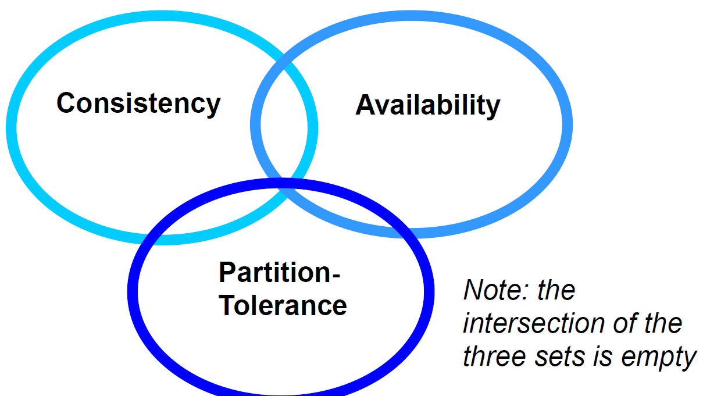
        - The CAP theorem forces us to consider trade-offs among different options
        - (not quite) While the theorem shows all three qualities are symmetrical, Consistency and Availability are at odds when a Partition happens (虽然定理表明这三个性质都是对称的，但是当一个分区发生时，一致性和可用性是不一致的)
            - “Hard” network partitions may be rare, but “soft” ones are not (a slow node may be considered dead even if it is not); ultimately, every partition is detected by a timeout
                - Can have consequences that impact the cluster as a whole
                    - e.g. a distributed join is only complete when all sub-queries return
                - Traditional DBMS architectures were not concerned with network partitions, since all data were supposed to be in a small, co-located cluster of servers
            - Consequence:
                - The emphasis on numerous commodity servers, can result in an increased number of hardware failures

5. CAP Theorem and the Classification of Distributed Processing Algorithms
    - 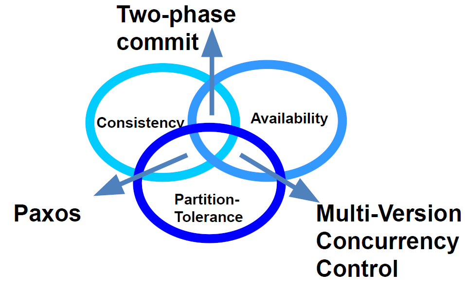

    1. Two phase commit: Consistency and Availability
        - This is the usual algorithm used in relational DBMS's (and MongoDB)

            ||what does it entail?|by|
            |---|---|---|
            |enforces consistency|every database is in a consistent state, and all are left in the same state|1. locking data that are within the transaction scope <br/>2. performing transactions on write-ahead logs <br/>3. completing transactions (commit) only when all nodes in the cluster have performed the transaction <br/>4. aborts transactions (rollback) when a partition is detected
            |reduced availability|data lock, stop in case of partition
        - Conclusion
            - Therefore, two-phase commit is a good solution when the cluster is co-located, less good when it is distributed
    2. Paxos: Consistency and Partition-Tolerance
        - This family of algorithms is driven by consensus, and is both partition-tolerant and consistent
        - In Paxos, every node is either a proposer or an accepter:
            - a proposer proposes a value (with a timestamp)
            - an accepter can accept or refuse it (e.g. if the accepter receives a more recent value)
            - When a proposer has received a sufficient number of acceptances (a quorum is reached), and a confirmation message is sent to the accepters with the agreed value
        - Conclusion
            - Paxos clusters can recover from partitions and maintain consistency, but the smaller part of a partition (the part that is not in the quorum) will not send responses, hence the availability is compromised
    3. Multi-Version Concurrency Control (MVCC): Availability and Partition-tolerance
        - MVCC is 
            - **a method to ensure availability** (every node in a cluster always accepts requests) and
            - **some sort of recovery from a partition** by reconciling the single databases with revisions (data are not replaced, they are just given a new revision number)
        - In MVCC, **concurrent updates are possible without distributed locks** (in optimistic locking only the local copy of the object is locked), since the updates will have different revision numbers; 
            - the transaction that completes last will get a higher revision number, hence will be considered as the current value.
        - In case of cluster partition and concurrent requests with the same revision number going to two partitioned nodes, both are accepted, but once the partition is solved, there would be a conflict. 
            - Conflict that would have to be solved somehow (CouchDB returns a list of all current conflicts, which are then left to be solved by the application).
        - To achieve consistency, Bitcoin uses a form of MVCC based on proof-of-work (which is a proxy for the computing power used in a transaction) and on repeated confirmations by a majority of nodes of a history of transactions.

#### Architecture
1. Sharding
    - What is it?  
        - Sharding is the partitioning of a database “horizontally”, i.e. the database rows (or documents) are partitioned into subsets that are stored on different
    servers. 
        - shard: Every subset of rows
    - Number of shards
        - Larger than the number of replica
        - the number of shards = the max number of nodes (lest a node contains the same shard file twice)
    - Number of nodes
        - larger than the number of replicas (usually set to 3)
        - The max number of nodes = the number of shards (lest a node contains the same shard file twice)    
    - The main advantage of a sharded database lies in the
        - improve performance through the distribution of computing load across nodes. 
            - i.e.: better distribution of data
        - makes it easier to move data files around, 
            - e.g. when adding new nodes to the cluster
    - sharding strategies:
        |||
        |---|---|
        |Hash sharding|to distribute rows evenly across the cluster|
        |Range sharding|similar rows (say, tweets coming for the same area) that are stored on the same node|
6. Replication and Sharding
    - What is replication?   
        - Replication is the action of storing the same row (or document) on different nodes to make the database fault-tolerant.
    - (adv) Replication and sharding can be combined with the objective of maximizing availability while maintaining a minimum level of data safety.
    - A bit of nomenclature:
        - n is the number of replicas (how many times the same data item is repeated across the cluster)
        - q is the number of shards (how many files a database is split)
        - n * q is the total number of shard files distributed in the different nodes of the cluster
7. Partitions
    - What is it?  
        - A partition is a grouping of logically related rows in the same shard 
            - e.g.: all the tweets of the same user
    - Advantage:  
        - Partitioning improves performance by restricting queries to a single shard
            - To be effective, partitions have to be relatively small (certainly smaller than a shard)
    - A database has to be declared “partitioned” during its creation
    - Partitions are a new feature of CouchDB 3.x
8. MapReduce Algorithms
    - What is it?  
        - This family of algorithms is particularly suited to parallel computing of the Single-Instruction, Multiple-Data type (SIMD) (see Flynn's taxonomy in a previous lecture)
    - Advantage:  
        - parallelism
        - greatly reducing network traffic by moving the process to where data are
    - Procedure:  
        1. Map: distributes data across machines, while 
        2. Reduce: hierarchically summarizes them until the result is obtained.

                function map(name, document):
                    for each word w in document:
                        emit (w, 1)
                function reduce(word, partialCounts):
                    sum = 0
                    for each pc in partialCounts:
                        sum += pc
                    emit (word, sum)
1. Clustered database architecture
    - Distributed databases are run over “clusters”, that is, sets of connected computers
    - Clusters are needed to: 
        - Distribute the computing load over multiple computers, e.g. to improve availability
        - Storing multiple copies of data, e.g. to achieve redundancy 
    - Consider two document-oriented DBMSs (CouchDB and MongoDB) and their typical cluster architectures
2. CouchDB Cluster Architecture
    - 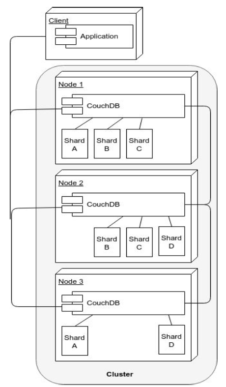
    - In this example there are 3 nodes, 4 shards and a replica number of 2
        - replica: copy of data
    - All nodes answer requests (read or write) at the same time
        - no master
    - Sharding (splitting of data across nodes) is done on every node
        - if a read request to shard A to node 1, then node 1 answer it
        - if a read request to shard A to node 2, then redirect it to node 1 or node 3 answer it
        - How Shards Look in CouchDB see lecture 7 slide 23 
            - and section "Replication and Sharding" below
            ```
            This is the content of the data/shards directory on a node of a three-node cluster
            The test database has q=8, n=2, hence 16 shards files
            The *.couch files are the actual files where data are stored
            The sub-directories are named after the document _ids ranges
            ```
    - When a node does not contain a document (say, a document of Shard A is requested to Node 2), the node requests it from another node (say, Node 1) and returns it to the client
    - Scalability: Nodes can be added/removed easily, and their shards are re-balanced automatically upon addition/deletion of nodes
    - Quorums
        - Write
            - Can only complete successfully if the document is committed to a quorum of replicas, usually a simple majority
        - Read
            - Can only complete successfully only if a quorum of replicas return matching documents
3. MongoDB Cluster Architecture
    - 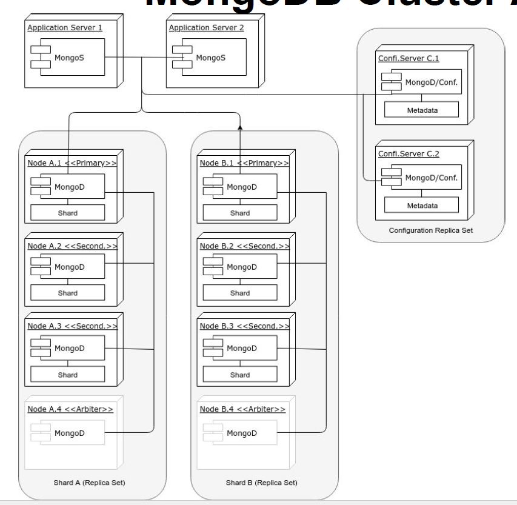
    - Sharding (splitting of data) is done at the replica set level
        - i.e.: it involves more than one cluster (a shard is on top of a replica set)
    - write requests can be answered only by the primary node in a replica set
    - read requests can be answered by every node (including secondary nodes) in the set 
        - depend on the specifics of the configuration 
    - Updates flow only from the primary to the secondary
        - If a primary node fails, or discovers it is connected to a minority of nodes, a secondary of the same replica set is elected as the primary
    - Data are balanced across replica sets 
    - Arbiters (MongoDB instances without data) can assist in breaking a tie in elections.
    - Since a quorum has to be reached, it is better to have an odd number of voting members (the arbiter in this diagram is only illustrative)
4. MongoDB vs CouchDB Clusters

    |                | MongoDB                                                      | CouchDB                                                      |
    | -------------- | ------------------------------------------------------------ | ------------------------------------------------------------ |
    | complexity     | Higher                                                       | Lower                                                        |
    | Availability   | Lower                                                        | Higher                                                       |
    | Accessibility  | MongoDB software routers must be embedded in application servers | Can connected by any HTTP client                             |
    | Data Integrity | Lossing two nodes in the MongoDB in this example implies losing write access to half the data, and possibly read access too, depending on the cluster configuration parameters and the nature of the lost node (primary or secondary) | Losing two nodes out of three in the CouchDB example implies losing access to between 1/4 and 1/2 the data, depending on the nodes that fail|in the MongoDB example implies **losing write access |
    | Functionality  | Some features, such as unique indexes, are not supported in MongoDB sharded environments | Can support this                                             |
    | CAP            | <u>**Two-phase commit**</u> for replicating data from primary to secondary. <br/>**<u>Paxos-like</u>** to elect a primary node in a replica-set. | MVCC                                                         |

    ||CouchDB|MongoDB|
    |---|---|---|
    |clusters are (difference in API)|less complex|more complex
    |clusters are|more available|less available, as - by default - only primary nodes can talk to clients for read operations, (and exclusively so for write operations)
    |software routers|while any HTTP client can connect to CouchDB|(MongoS) must be embedded in application servers
    |Losing two nodes|out of three in the CouchDB architecture shown, means **losing access to between 1/4 and 1/2 the data, depending on the nodes that fail**|in the MongoDB example implies **losing write access** to half the data (although there are ten nodes in the cluster instead of three), and possibly read access too, depending on the cluster configuration parameters and the nature (primary or secondary) of the lost nodes|
    |Some features (such as unique indexes)||not supported in MongoDB sharded environmen
    |Classification of Distributed Processing Algorithms|uses MVCC|- uses a mix of two-phase commit (for replicating data from primary to secondary nodes) <br/> - Paxos-like (to elect a primary node in a replica-set)|
    |emphasis on and all have partition-tolerance|Availability|consistency|
    - These differences are rooted in different approaches to an unsolvable problem, a problem defined by Brewer’s CAP Theorem
        - first 5
    - The different choices of strategies explains the different cluster architectures of these two DBMSs
        - last 2


### Introduction to CouchDB
- Part 2: Introduction to CouchDB, recording 07:: 01:15:16


## Week 8.1 – Virtualisation
Terminology
- 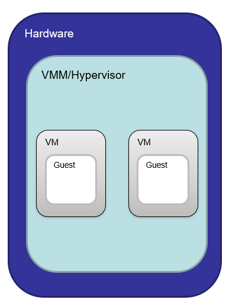
- 
    |||
    |---|---|
    |Virtual Machine Monitor/Hypervisor|The virtualisation layer between the underlying hardware the virtual machines and guest operating systems it supports.
    |Virtual Machine|A representation of a real machine using hardware/software that can host a guest operating system
    |Guest Operating System|An operating system that runs in a virtual machine environment that would otherwise run directly on a separate physical system.
1. What happens in a VM?
    - 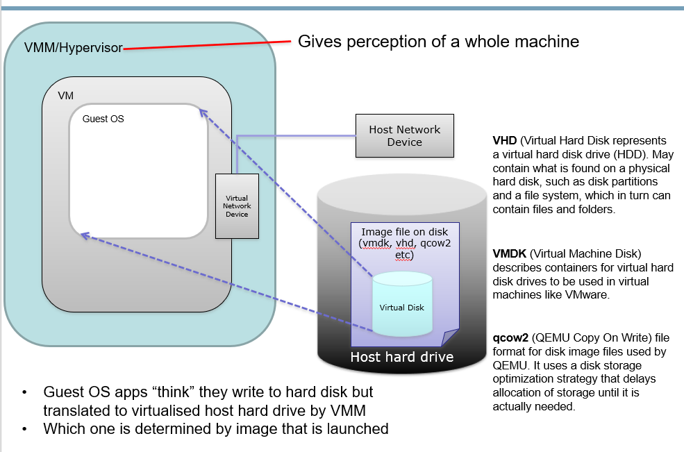
    - Inside the virtual machine, there are Virtual Network Device, VHD(Virtual Hard disk), VMDK(Virtual Machinie Disk), qcow2(QEMU Copy on Write)
    - Guest OS apps “think” they write to hard disk but translated to virtualised host hard drive by VMM
        - Which one is determined by image that is launched

2. Motivation ~~& History~~
    |motivation||
    |---|---|
    |Server Consolidation|1. Increased utilisation<br/>2. Reduced energy consumption
    |Personal virtual machines can be created on demand|1. No hardware purchase needed<br/>2. Public cloud computing - won't lockin Amazon
    |Security/Isolation|Share a single machine with multiple users - won't want everyone see what you are doing
    |Hardware independence|Relocate to different hardware
    - originally, virtual machine = an efficient, isolated duplicate of the real machine
        - Properties of interest (can also be thought as motivation):
            - Fidelity
                - Software on the VMM executes behaviour identical to that demonstrated when running on the machine directly, barring timing effects
            - Performance
                - An overwhelming majority of guest instructions executed by hardware without VMM intervention
            - Safety
                - The VMM manages all hardware resources
    - history see lecture 8.1 slide 7
3. Classification of Instructions
    ||||
    |---|---|---|
    |Privileged Instructions|instructions that trap if the processor is in user mode and do not trap in kernel mode
    |Sensitive Instructions|instructions whose behaviour depends on the mode or configuration of the hardware|Different behaviours depending on whether in user or kernel mode<br/>- e.g. POPF interrupt (for interrupt flag handling)
    |Innocuous Instructions|instructions that are neither privileged nor sensitive|Read data, add numbers etc
    - Popek and Goldberg Theorem  
        - For any conventional third generation computer, a virtual machine monitor may be constructed if the set of **sensitive instructions** for that computer is a subset of the set of **privileged instructions** i.e. have to be trappable
    - x86 architecture was historically not virtualisable, due to **<u>sensitive instructions</u> that could not be trapped** 
    - Intel and AMD introduced extensions to make x86 virtualisable
3. What are the requirements for virtualisation?
    - 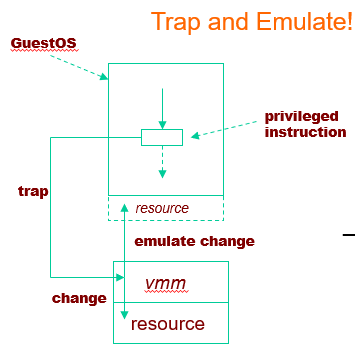
    |Typical Virtualisation Strategy||Achieved by|problem|
    |---|---|---|---|
    |De-privileging (trap-and-emulate)|trap-and-emulate: VMM emulates the effect on system/hardware resources of privileged instructions whose execution traps into the VMM|running GuestOS at a lower hardware priority level than the VMM|Problematic on some architectures where privileged instructions do not trap when executed at de-privileged level
    |Primary/shadow structures|1. VMM maintains “shadow” copies of critical structures whose “primary” versions are manipulated by the GuestOS, e.g. memory page tables<br/>2. Primary copies needed to insure correct versions are visible to GuestOS
    |Memory traces|Controlling access to memory so that the shadow and primary structure remain coherent|write-protect primary copies so that update operations cause page faults which can be caught, interpreted, and addressed <br/>- Someones app/code doesn’t crash the server you are using!!!
4. Virtualisation approaches (compare with each other pair wise 1 v.s. 2, ...)
    |Aspects of VMMs|What is it?|e.g.|Advantages|Disadvantages|
    |---|---|---|---|---|
    |Full virtualisation|allow an unmodified guest OS to run in isolation by simulating full hardware <br/>- Guest OS has no idea it is not on physical machine|VMWare|1. Guest is unaware it is executing within a VM<br/>2. Guest OS need not be modified<br/>3. No hardware or OS assistance required<br/>4. Can run legacy OS|1. can be less efficient|
    |Para-virtualisation|- VMM/Hypervisor exposes special interface to guest OS for better performance. Requires a modified/hypervisor-aware Guest OS <br/> - Can optimise systems to use this interface since not all instructions need to be trapped/dealt with|Xen|1. Lower virtualisation overheads, so better performance|1. Need to modify guest OS - Can’t run arbitrary OS!<br/>2. Less portable<br/>3. Less compatibility<br/>
    |Hardware-assisted virtualisation|Hardware provides architectural support for running a Hypervisor<br/>- New processors typically have this<br/>- Requires that all sensitive instructions trappable|KVM|1. Good performance<br/>2. Easier to implement<br/>3. Advanced implementation supports hardware assisted DMA, memory virtualisation|1. Needs hardware support
    |Binary Translation|Trap and execute occurs by scanning guest instruction stream and replacing sensitive instructions with emulated code <br/> - Don’t need hardware support, but can be much harder to achieve|VMWare|1. Guest OS need not be modified<br/>2. No hardware or OS assistance required<br/>3. Can run legacy OS|1. Overheads<br/> 2. Complicated<br/> 3. Need to replace instructions “on-the-fly”<br/> 4. Library support to help this, e.g. vCUDA
    |Bare Metal Hypervisor|VMM runs directly on actual hardware<br/>- Boots up and runs on actual physical machine<br/>- VMM has to support device drivers, all HW mgt |VMWare ESX Server
    |Hosted Virtualisation|VMM runs on top of another operating system|VMWare Workstation
    |Operating System Level Virtualisation|1. Lightweight VMs<br/>2. Instead of whole-system virtualisation, the OS creates mini-containers|Docker|1. Lightweight<br/>2. Many more VMs on same hardware<br/>3. Can be used to package applications and all OS dependencies into container|1. Can only run apps designed for the same OS<br/>2. Cannot host a different guest OS<br/>3. Can only use native file systems<br/>4. Uses same resources as other containers|
    |Memory Virtualisation|VMM maintains shadow page tables in lock-step with the page tables.<br/> detail see below section|||1. Adds additional management overhead
    - 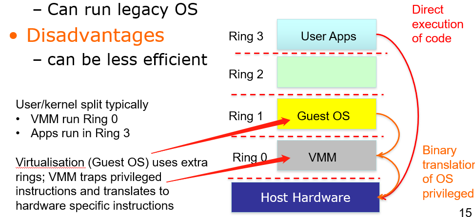  for Full virtualisation, Binary Translation
        - but in each case there can be some differences in rangs for each service see lecture 8.1 slides 15, 19
    - 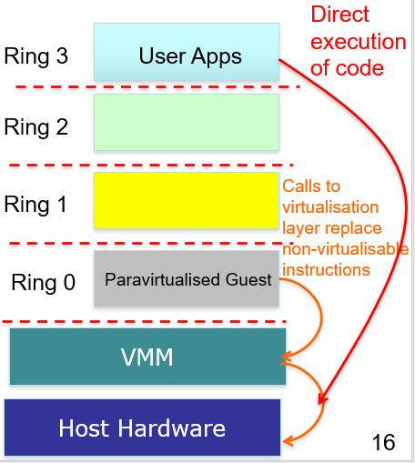 for Para-virtualisation, Hardware-assisted virtualisation
        differ in ring 0 service, see lecture 8.1 slides 16, 18
        - New Ring -1 for VMM supported Page tables, virtual memory mgt, direct memory access for high speed reads etc
        
5. Memory Virtualisation
    - 
        - In conventional case, page tables store the logical page number and physical page number mappings
    - 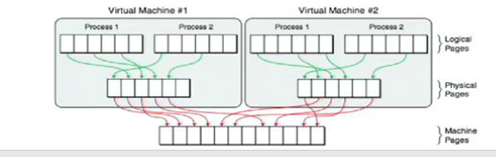
        
        - In VMM case, VMM maintains shadow page tables in lock-step with the page tables. Additional management overhead is added.
    - Shadow Page Tables
        - VMM maintains shadow page tables in lock-step with the page tables
        - 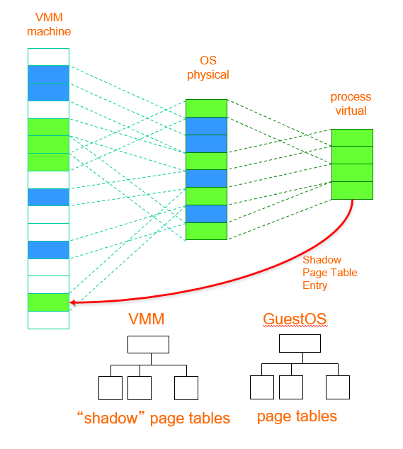
        - In this case, one OS represent in blue, the other in green
        - Disadv: Adds additional management overhead
            - Hardware performs guest -> physical and physical -> machine translation
6. Live migration
    - having continuity of service during data moving
    - Live Migration from Virtualisation Perspective/Live migration of virtual machines
        - see lecture 8.1 slide 25

## Week 8.2 – OpenStack & Comparing and Contrasting AWS with NeCTAR Cloud
- Offers free and open-source software platform for cloud computing for <u>**IaaS**</u>
- Consists of interrelated components (services) that control / support compute, storage, and networking resources
- Often used through web-based dashboards, through command-line tools, or programmatically through ReSTful APIs
### Typically asynchronous queuing systems used (AMQP)
- 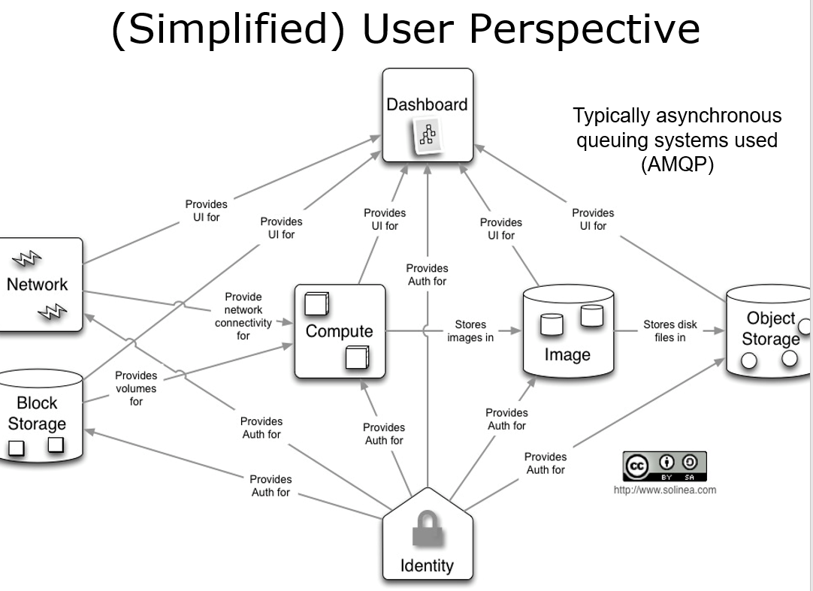

### Key Services
#### Keystone -- Identity Service
- Provides an authentication and authorization service fro OpenStack services
  - Tracks users/permissions
- Provides a catalog of endpoints for all OpenStack services
  - Each service registered during install
    - Know where they are and who can do what with them
  - Project membership
  - firewall rules
- Generic authorization system
  - More refer to week10 ==TODO==
#### Nova -- Compute Service
- Manages the lifecycle of compute instances in an OpenStack environment
- Responsibilities for virtual machines on demand, include 
  - spawning
  - scheduling
  - Decommissioning
- Virtualisation agnostic
  - Key point of success as it allows openStack works with **<u>any kind</u>** of virtualisation solution, including
    - XenAPI, Hyper-V, VMWare ESX
    - Docker
  - You are not binding with any specific solution
- ==(The following not covered in detail in the lecture)==
- API
  - Nova-api
    - Accepts/responds to end user API calls
    - Supports openStack Compute & EC2 & admin APIs
  - Compute Core
    - Nova-computer
      - Daemon that creates/terminates VMs through hypervisor APIs
    - Nova-scheduler
      - schedules VM instance requests from queue and determines which server host to run
    - Nova-conductor
      - Mediates interactions between compute services and other components, e.g. image database
  - Networking
    - Nova-network
      - Accepts network tasks from queue and manipulates network, e.g. changing IP table rules
#### Swift - Object Storage
- Stores and retrieves arbitrary unstructured data objects via ReSTful API
  - VM images and data
  - This service can be used to access arbitrary unstructured data
- Fault tolerant with data replication and scale-out architecture
  - Available from anywhere; persists until deleted
  - Allows to write objects and files to multiple drives, ensuring the data is replicated across a server cluster
- Can be used with/without **<u>Nova</u>**
- Client/admin support
  - Swift client allows users to submit commands to ReST API through command line clients to configure/connect object storage to VMs
#### Cinder -- Block Storage
- Provides persistent block storage to virtual machines (instances) and supports creation and management of block storage devices
- Cinder access associated with a VM
  - Cinder-api
    - routes requests to cinder-volume
  - Cinder-volume
    - interacts with block storage service and scheduler to read/write requests; can interact with multiple flavours of storage (flexible driver architecture)
  - Cinder-scheduler
    - selects optimal storage provider node to create volumes (ala nova-scheduler)
  - Cinder-backup
    - provides backup to any types of volume to backup storage provider
#### Glance -- Image Service
- Accepts requests for disk or server images and their associated metadata (from **<u>Swift</u>**) and retrieves / installs (through **<u>Nova</u>**)
  - Find the image at **<u>Swift</u>**, but getting the image at **<u>Glance</u>**
- API
  - Glance-api
    - Image discovery, retrieval and storage requests
  - Glance-registry
    - Stores, processes and retrieves metadata about images, e.g. size and type
      - Ubuntu 14.04
      - My last good snapshot
        - I (the owner) can control who can access the snapshot using **<u>Keystone</u>**
#### Neutron -- Networking Services
- Supports networking of OpenStack services
  - subnet
  - Network in and out
  - Network security group
- Offers an API for users to define networks and the attachments into them,
  - switches
  - routers
- Pluggable architecture that supports multiple networking vendors and technologies
- Neutron-server
  - accepts and routes API requests to appropriate plug-ins for action
  - Port management, e.g. default SSH, VM-specific rules, ...
  - More broadly configuration of availability zone networking, e.g. subnets, DHCP, ...
#### Horizon -- Dashboard Service
- Provides a web-based self-service portal to interact with underlying OpenStack services, such as 
  1. launching an instance
  2. assigning IP addresses
  3. configuring access controls
- Based on Python/Django web application
- Requires Nova, Keystone, Glance, Neutron
- Other services optional...
#### Trove -- Database Service
- Provides scalable and reliable Cloud database (DBaaS) functionality for both <u>relational</u> and <u>non-relational</u> database engines
- Benefits
  - Resource isolation
  - high performance
  - automates deployment
  - config
  - patching
  - backups
  - restores
  - monitoring
  - ...
- Use image service for each DB type and trove-manage to offer them to tenants/user communities
#### Sahara -- Data Processing Service
- Provides capabilities to provision and scale Hadoop clusters in OpenStack by specifying parameters such as Hadoop version, cluster topology and node hardware details
- User fills in details and Sahara supports the automated deployment of infrastructure with support for addition/removal of worker nodes on demand
#### Heat -- Orchestration Service
- Template-driven service to manage lifecycle of applications deployed on Openstack
- Stack
  - Another name for the template and procedure behind creating infrastructure and the required resources from the template file
- Can be integrated with automation tools such as Chef
  - Puppet
  - Ansible
- Heat details
    - heat_template_version: allows to specify which version of Heat, the template was written for (optional)
    - Description: describes the intent of the template to a human audience (optional)
    - Parameters: the arguments that the user might be required to provide (optional)
    - Resources: the specifications of resources that are to be created (mandatory)
    - Outputs: any expected values that are to be returned once the template has been processed (optional)

### Creating Stacks in MRC/NeCTAR
1. Create the template file according to your requirements
2. Provide environment details (name of key file, image id, etc)
3. Select a name for your stack and confirm the parameters
4. Make sure rollback checkbox is marked, so if anything goes wrong, all partially created resources get dumped too
5. Wait for the magic to happen! 


## Week 8.3 - Serverless (Function as a Service (FaaS))
1. Why Functions?
    - A function in computer science is typically a piece of code that takes in parameters and returns a value
    - Functions are the founding concept of functional programming - one of the oldest programming paradigms
    - Why they are used in Faas?
    - Functions
        - free of side-effects, 
            - What is it?
                - A function that does not modify the state of the system
                    - e.g.: a function that takes an image and returns a thumbnail of that image
                - A function that changes the system somehow is not side-effect free
                    - e.g.: a function that writes to the file system the thumbnail of an image
            - How Side-effect free benefits parallel execition?
                - Side-effect free functions can be run in parallel, and are guaranteed to return the same output given the same input
            - How it benefits FaaS?
                - Side-effects are almost inevitable (不可避免的) in a relatively complex system. 
                Therefore consideration must be given on how to make functions with side effects run in parallel, as typically required in FaaS environments.
        - ephemeral (短暂的;瞬息的),
            - Synchronous/Asynchronous Functions
            - Relationship to FaaS
                - By default functions in FaaS are synchronous, hence they return their result immediately
                - However, there may be functions that take longer to return a result, hence they incur timeouts and lock connections with clients in the process, hence it is better to transform them into asynchronous functions
                    - a publish/subscribe pattern involving a queuing system can be used to deal with asynchronous functions
            - How them work?
                |Function|How|
                |---|---|
                |Synchronous functions|return their result immediately
                |Asynchronous functions|return a code that informs the client that the execution has started, and then trigger an event when the execution completes
        - stateless, 
            - What is it?
                - A subset of functions with side-effects is composed of stateful functions 
                    |||e.g.|
                    |---|---|---|
                    |stateful function|is one whose output changes in relation to internally stored information (hence its input cannot entirely predict its output)| a function that adds items to a "shopping cart" and retains that information internally
                    |stateless function|is one that does not store information internally|adding an item to a "shopping cart" stored in a DBMS service and not internally would make the function above stateless, but not side-effect free.
            - Why it is important for FaaS?
                - Because there are multiple instances of the same function, and there is no guarantee the same user would call the same function instance twice.
        - which make them ideal for 
            - parallel execution and 
            - rapid scaling-up and -down
            - Functions are free of side-effects, ephemeral, and stateless, which make them ideal for parallel execution and rapid scaling-up and -down, hence their use in FaaS
2. Function & FaaS
    - Side effects
    - stateful & stateless
    - Synchronous/Asynchronous Functions
3. What is Function as a Service (FaaS)?
    - FaaS is also know as Serverless computing
    - FaaS is an extreme form of microservice architecture
    - The idea behind Serverless/FaaS is to develop software applications without bothering with the infrastructure (especially scaling-up and down as load increases or decreases). Therefore, it is more Server-unseen than Server-less
    - What does it do?
        - A FaaS service allows functions to be added, removed, updated, executed, and auto-scaled
4. Why we need Faas?
    |Reason|How|
    |---|---|
    |Simpler deployment|the service provider takes care of the infrastructure
    |Reduced computing costs|only the time during which functions are executed is billed
    |Reduced application complexity|due to loosely-coupled architecture
5. FaaS application
    - Functions are triggered by events
    - Functions can call each other
    - Functions and events can be combined to build software applications
    - Combining event-driven scenarios and functions resembles how User Interface software is built: user actions trigger the execution of pieces of code
    - E.g.: FaaS Services and Frameworks
        - Amazon’s AWS Lambda
        - Google Cloud Functions
        - Azure Functions by Microsoft
    - proprietary FaaS services v.s. open-source FaaS frameworks
        - open-source FaaS frameworks can be deployed on your cluster, peered into, disassembled, and improved by you.

## Workshop week5: OpenFaaS
### Properties
- Open-source framework that uses Docker containers to deliver FaaS functionality
- Every function in OpenFaaS is a Docker container, ensuring loose coupling between functions
  - Function can be written in different languages and mixed freely
- Functions are passed a request as an object in the language of choice and return a response as an object
- OpenFaaS can use either Docker Swarm or Kubernetes to manage cluster of nodes on which functions run
- By using Docker containers as functions, OpenFaaS allow to freely mix different languages and environments at the cost of **<u>decreased performance</u>** as containers are inherently heavier than threads
  - However, it is possible to reduce the size to only a few MBs
### Auto-scalability and OpenFaaS
- OpenFaaS can add more Docker containers when a function is called more often, and remove containers
when the function is called less often 
- The scaling-up (and down) of functions can be tied to memory or CPU utilization as well (currently only on Kubernetes-managed clusters though)

## Week 9 - Big Data Analytics
1. Why we need it?
    - There would not be much point in amassing vast amount of data without being able to analyse it, hence the blossoming of large-scale business intelligence and more complex machine learning algorithms. 
    - Overlapping among business intelligence, machine learning, statistics and data mining.
        - Just use big data analytics
2. What is it?
    - There is a good deal of overlap and confusion among terms such as business intelligence, machine learning, statistics, and data mining. For the sake of clarity, we just use the more general term (big) data analytics
3. Examples of Analytics
    ||
    |---|
    |Full-text searching
    |Aggregation of data
    |Clustering
    |Sentiment analysis
    |Recommendations
4. Challenges of Big Data Analytics
    - A framework for analysing big data has to distribute both data and processing over many nodes, which implies:
        |imply||
        |---|---|
        |Reading and writing distributed datasets
        |Preserving data in the presence of failing data nodes
        |Supporting the execution of MapReduce tasks
        |Being fault-tolerant|a few failing compute nodes may slow down the processing, but not stop it
        |Coordinating the execution of tasks across a cluster
5. Tools for Analytics:
    - Apache Hadoop
    - Apache Spark
### Apache Hadoop
1. How it works?
    - Apache Hadoop started as a way to distribute files over a cluster and execute MapReduce tasks, but many tools have now been built on that foundation to add further functionality
2. Components
    - Hadoop Distributed File System (HDFS)
    - Hadoop Resource Manager (YARN)
2. Hadoop Distributed File System (HDFS)
    - What is it?
        - The core of Hadoop is a fault tolerant file system that has been explicitly designed to span many nodes
    - HDFS blocks v.s. blocks
        - HDFS blocks are much larger than blocks used by an ordinary file system (say, 4 KB versus 128MB)
        - Why?
            ||How achieve it?|
            |---|---|
            |Reduced need for memory to store information about where the blocks are|metadata
            |More efficient use of the network|with a large block, a reduced number network connections needs to be kept open
            |Reduced need for seek operations on big files
            |Efficient when most data of a block have to be processed
    - HDFS Architecture
        - A HDFS file is a collection of blocks stored in datanodes, with metadata (such as the position of those blocks) that is stored in namenodes
        - 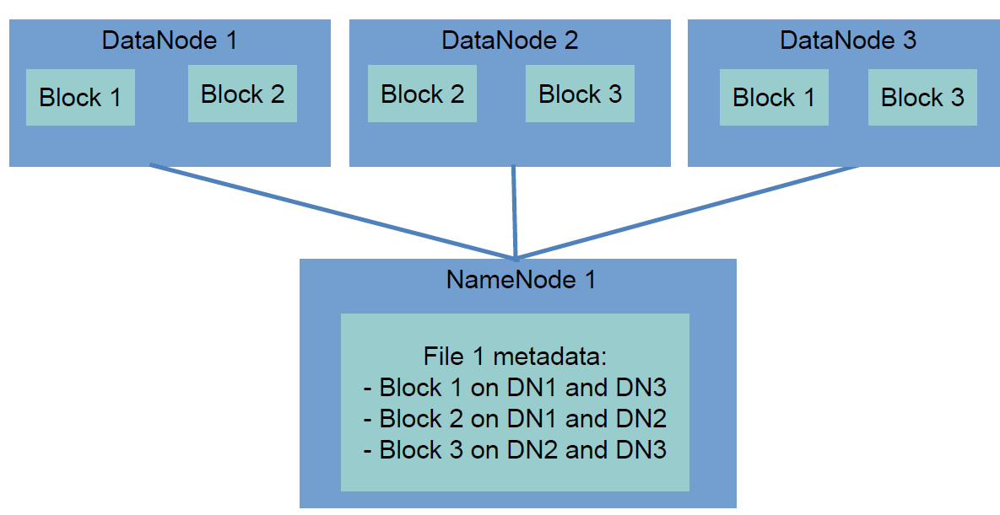
    - The HDFS Shell
        - Why we need it?
            - Managing the files on a HDFS cluster cannot be done on the operating system shell
                - hence a custom HDFS shell must be used.
        - The HDFS file system shell replicates many of the usual commands (ls, rm, etc.), with some other commands dedicated to loading files from the operating system to the cluster (and back)
3. The Hadoop Resource Manager (YARN)
    - What is it/What does it do?
        - YARN deals with Executing MapReduce jobs on a cluster
            - It is composed of a central ***Resource Manager*** and
            - Many ***Node Managers*** that reside on slave machines
    - Every time a MapReduce job is scheduled for execution on a Hadoop cluster, YARN starts an **<u>Application Master</u>** that negotiates resources with the **<u>Resource Manager</u>** and starts Containers on the slave nodes
        - Containers are the processes where the actual processing is done
5. Programming on Hadoop
### Apache Spark
1. Why Spark not Hadoop?/Spark v.s. Hadoop
    - While Hadoop MapReduce works well, it is geared towards performing relatively simple jobs on large datasets.
        - While the execution order of Hadoop MapReduce is fixed, the lazy evaluation of Spark allows the developer to stop worrying about it, and have the Spark optimizer take care of it. 
        - In addition, the driver program can be divided into steps that are easier to understand without sacrificing performance (as long as those steps are composed of transformations).
    - However, when complex jobs are performed, we would like
        - Caching data in memory
        - Having finer-grained control on the execution of the jobs
    - Spark was designed to 
        - reduce the latency inherent in the Hadoop approach for the execution of MapReduce job
        - How?
            - The transformations in the program use lazy evaluation, hence Spark has the possibility of optimizing the process
    - Spark can operate within the Hadoop architecture, using YARN and Zookeeper to 
        - Manage computing resources
        - Storing data on HDFS
    - Spark has a tightly-coupled nature of its main components
    - Spark has a cluster manager of its own, but it can work with other cluster managers, such as YARN or MESOS.
2. Spark Architecture
    - One of the strong points of Spark is the tightly-coupled nature of its main components
        - 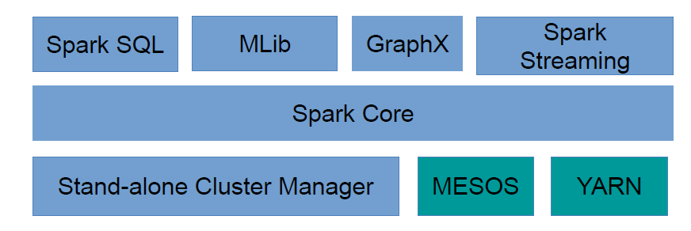
    - Spark ships with a cluster manager of its own, but it can work with other cluster managers, such as YARN or MESOS.
3. The Spark Shell
    - Lecture 09:: 00:39:50
4. Programming on Spark
    - Lecture 09:: 00:34:24
5. Spark Runtime Architecture
    - Applications in Spark are composed of different components including
      - Job
        - The data processing that has to be performed on a dataset
        - the overall processing that Spark is directed to perform by a driver program
      - Task
        - A single operation on a dataset
        - a single transformation operating on a single partition of data on a single node
      - Stage
        - Set of task operating on a single partition
        - A job is composed of more than one stage when data are to be transferred across node
        - The fewer the number of stages, the faster the computation (shuffling data across the cluster is slow)
      - Executors
        - The processes in which tasks are executed
      - Cluster Manager
        - The process assigning tasks to executors
      - Driver program
        - The main logic of the application
      - Spark application
        - Driver program + Executor
      - Spark Context
        - The general configuration of the job
    - These different components can be arranged in **<u>three</u>** different deployment modes (below) across the cluster
    - Spark Runtime Mode
        - Local Mode
            - In local mode, every Spark component runs within the same JVM. However, the Spark application can still run in parallel, as there may be more than on executor active
            - When used?
                - Good for developing and debugging
        - Cluster Mode
            - In cluster mode, every component, including the driver program, is executed on the cluster. Upon launching, the job can run autonomously. 
            - When used?
                - This is the common way of running non-interactive Spark jobs.
        - Client Mode
            - The driver program talks directly to the executors on the worker nodes. Therefore, the machine hosting the driver program has to be connected to the cluster until job completion.
            - When used? 
                - Client mode must be used when the applications are interactive, as happens in the Python or Scala Spark shells.
6. Resilient Distributed Dataset (RDDs) (Central to Spark)
    - What is it?
        - the way data are stored in Spark during computation, and understanding them is crucial to writing programs in Spark:
            ||What?|
            |---|---|
            |Resilient|data are stored redundantly, hence a failing node would not affect their integrity
            |Distributed|data are split into chunks, and these chunks are sent to different nodes
            |Dataset|a dataset is just a collection of objects, hence very generic
    - Properties of RDDs
        - RDDs are
            |Property||benefit
            |---|---|---|
            |immutable|once defined, they cannot be changed|simplifies parallel computations on them, and <br/>is consistent with the functional programming paradigm
            |transient|they are meant to be used only once, then discarded (but they can be cached, if it improves performance)|
            |lazily-evaluated|the evaluation process happens only <br/> - when data cannot be kept in an RDD, as when the number of objects in an RDD has to be computed, <br/> - or an RDD has to be written to a file (these are called actions), but <br/> - not when an RDD are transformed into another RDD (these are called transformations)|optimizing the process
            - The transformations in the program use lazy evaluation, hence Spark has the possibility of optimizing the process
    - How to Build an RDD?
        - created out of data stored elsewhere (HDFS, a local text file, a DBMS)
        - created out of collections too, using the parallelize function

## Week 10.1 – Security and Clouds
1. Why is security so important?
    - If systems (Grids/Clouds/outsourced infrastructure!) are not secure 
        - Large communities will not engage
            - medical community, industry, financial community, etc they will only use their own internal resources, e.g.: private clouds!
    - Expensive to repeat some experiments
        - Huge machines running large simulations for several years
    - Legal and ethical issues possible to be violated with all sorts of consequences
        - e.g. data protection act violations and fines incurred
            - Amazon Web Services, Sydney
    - Trust is easily lost and hard to re-establish
- What do we mean by security anyway?
    - Secure from whom?
        - From sys-admin?
        - From rogue employee?
- Secure against what?
    - Security is never black and white but is a grey landscape where the context determines the accuracy of how secure a system is
        - e.g. secure as given by a set of security requirements
- security technology ≠ secure system
    - Ultra secure system using 2048+ bit encryption technology, packet filtering firewalls, …
        - on laptop in unlocked room
        - on PC with password on “post-it” on screen/desk
        - the challenge of peta/exa-scale computers and possibility for brute force cracking
2. The Challenge of Security
    - Grids and Clouds (IaaS) allow users to compile codes that do stuff on physical/virtual machines
        - In the Grid world a rich blend of facilities co-existed (were accessible/integrated!) which had "issues" - prevent people do bad staff
            - Highly secure supercomputing facilities compromised by single user PCs/laptops
            - Need security technologies that scales to meet wide variety of applications 
        - Using services for processing of patient data through to “needle in haystack” searching of physics experiments
    - Should try to develop generic security solutions
        - Avoid all application areas re-inventing their own (incompatible/inoperable) solutions
    - Clouds allow scenarios that stretch inter-organisational security
        - Policies that restrict access to and usage of resources based on pre-identified users, resources
            - Groups/tenancy…
        - But what if new resources added, new users added, old users go…?
            - Over-subscription issues
            - User management (per user, per team, per organisation, per country…)
        - What if organisations decide to change policies governing access to and usage of resources, or bring their data back inside of their firewall?
            - Really not replicated somewhere else?
        - What if you share a tenancy with a noisy neighbour!
            - I/O demanding applications
                - You hopefully never experienced this, but early NeCTAR RC had performance issues!
        - The multi-faceted challenges of ”life beyond the organisational firewall”?
3. Technical Challenges of Security
    - All are important but some applications/domains have more emphasis on concepts than others
        - Key is to make all of this simple/transparent to users!
    - 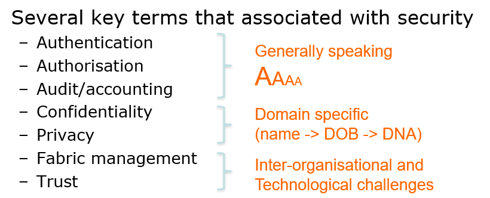
    - Single sign-on
        - What is it?
            - Login once, but can access many more resources that potentially provided by other providers
            - When you login The university of Melbourne Cloud, you could also access the amazon cloud
        - **The Grid model (and Shib model!) needed**
        - **Currently not solved for Cloud-based IaaS**
        - Onus (责任) is on non-Cloud developers to define/support this
    - Auditing 
        - What is it?
            - logging, intrusion detection, auditing of security in external computer facilities. Logging the actions by each user
                - When bad thing happen, we have the record
        - **well established in theory and practice and for local systems**
            - Less mature in Cloud environments (beyond the firewall!)
        - Tools to support generation of diagnostic trails 
            - Across federations of Clouds?
            - Log/keep all information?
            - For how long?
        - Problem
            - The record are distributed most of time
        - Solution
            - Use block-chain ledger to provide confidentiality of the log
    - Deletion (and encryption!!!)
        - **Data deletion with no direct hard disk** (might cost a lot of money to delete it)
            - Many tools and utilities don’t work!
        - Scale of data
            - Securely deleting a few Mb easy enough
    - Liability
        - Using contract to state the risk when put data here
    - Licensing
        - Challenges with the Cloud delivery model (Where can jobs realistically run)
        - Many license models
            - Per user
            - Per server
            - Per organisation
            - Floating licenses
            - Fixed to machines
    - Workflows
        - Many workflow tools for combing SoA services/data flows
            - Taverna, Pegasus, Galaxy, Kepler, Nimrod, OMS, …
        - **Many workflows models**
            - Orchestration (**centralised** definition/enactment),
            - Choreography (**decentralised**)
        - Serious challenges of 
            - defining, 
            - enforcing, 
            - sharing, 
            - enacting 
        - security-oriented workflows
    - The Ever Changing Technical/Legal Landscape 
        - requirements and guarantee on cloud using

- Authentication
    What does it do?
        - prove who you are
    - What is it?
        - Authentication is <u>**the establishment and propagation of a user’s identity in the system**</u>
        - e.g. so site X can check that user Y is attempting to gain access to it’s resources
            - Note <u>**does not check what user is allowed to do, only that we know (and can check!) who they are**</u>
                - <u>**Masquerading always a danger**</u> (and realistic possibility)
                - Security guidance/balances
                    - Password selection
                        - 16 characters, upper/lower case and must include nonalphanumeric characters and be changed quarterly…!?!?!?!
                    - Treatment of certificates
        - challenge: 
            - Local username/password?
                - 100,000+ users that come and go (scalability)
            - Centralised vs decentralised systems?
                - More scalable solution needed
                - Decentralised Authentication (Proof of Identity) thru Shibboleth
                    - 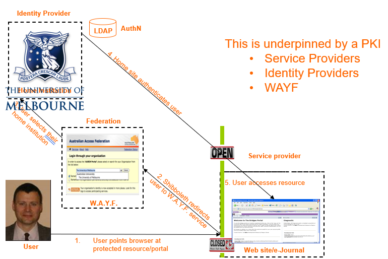
                    - Supports Single-Sign On (in case you were unaware)
    - Public Key Infrastructures (PKI) underpins MANY systems
        - What is it?
            - an arrangement that binds public key with respective identities of entities(like people and organization). 
            - The binding is established through a process of registration and issurance of certificates at and by a certificate authority 
            - The PKI role that assures valid and correct registration is called a registration authority(RA). RA is responsible for accepting requests for digital certificates and authenticating the entity making the reques
        - Based on public key cryptography
        - Public Key Cryptography
            - Also called Asymmetric Cryptography
                - Two distinct keys
                    - One that must be kept private
                        - Private Key
                    - One that can be made public
                        - Public Key
                - Two keys complementary, but essential that cannot find out value of private key from public key
                    - With private keys can digitally sign messages, documents and validate them with associated public keys
                        - Check whether changed, useful for non-repudiation
            - Public Key Cryptography simplifies key management
                - Don’t need to have many keys for long time
                    - The longer keys are left in storage, more likelihood of their being compromised
                        - Instead use Public Keys for short time and then discard
                        - Public Keys can be freely distributed
                    - Only Private Key needs to be kept long term and kept securely
        - PKI and Cloud
            - So what has this got to do with Cloud…?
                - IaaS – key pair!
            - Cloud inter-operability begins with security!
                - There is no single, ubiquitous CA, there are many
            - There are many ways to prove your identity
                - OpenId, FacebookId, Visa credit card for Amazon, …
                    - Degrees of trust 
                - But remember need for single sign-on
                - Prove identity once and access distributed, autonomous resources!
        - Public Key Certificates
            - (PKC & PKI) Mechanism connecting public key to user with corresponding private key is Public Key Certificate 
                - Public key certificate contains public key and identifies the user with the corresponding private key
                    - Distinguished Name (DN): CN=Richard Sinnott; OU=Dept CIS; O=UniMelb; C=AU
                - Not a new idea
                    - Business card
                        - My name, my association, contact details, …
                            - Can be distributed to people I want to exchange info with
                        - If include public key on it, then have basic certificate, but
                            - has to be delivered in person (or no trust!), who says I work at Melbourne?, could be a forgery, I might be an impostor, what if I move to Monash or my phone number changes, who would have 1024-bit key on business card, …
            - Public Key Certificates & Certification Authority
                - Public Key Certificates issued by trusted "Certification Authority"
        - Certification Authority
            - What it it?
                - <u>**Central component of PKI is Certification Authority (CA)**</u>
            - CA has numerous responsibilities 
                - <u>**Policy and procedures**</u>
                    - How to’s, do’s and don’ts of using certificates 
                    - Processes that should be followed by users, organisations, service providers …(and consequence for violating them!)
            - challenge: 
                - Issuing certificates
                    - Often need to delegate to local Registration Authority
                    - Prove who you are, e.g. with passport, student card
                - Revoking certificates
                    - Certificate Revocation List (CRL) for expired/compromised certificates
                - Storing, archiving 
                    - Keeping track of existing certificates, various other information, …
            - models
                - 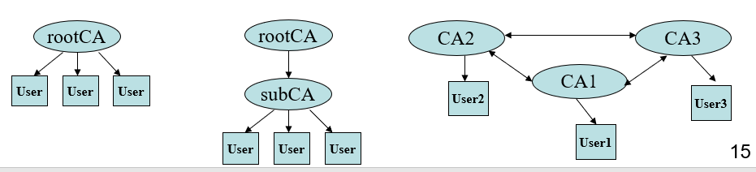
            - Typical Simple CA
                - Based on statically defined centralised CA with direct single hierarchy to users
                - Typical scenario for getting a certificate
                - steps:
                - 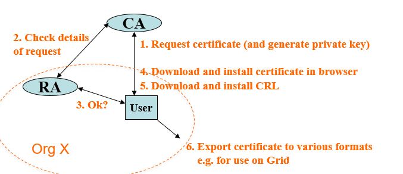
- Authorisation
    - What is it?
        - Authorisation is concerned with controlling access to resources based on policy 
            - Can this user invoke this service, make use of this data?
            - Complementary to authenticationL Know it is this user, now can we restrict/enforce what they can/cannot do
    - Many different approaches for authorisation
        |approach|e.g.|
        |---|---|
        |Group Based Access Control|your project VMs
        |Role Based Access Control|RBAC
        |Identity Based Access Control|IBAC
        |Attribute Based Access Control|ABAC
    - Many Technologies
        - XACML, PERMIS, CAS, VOMS, AKENTI, VOMS, SAML, WS-*
    - typical model: RBAC
        - Basic idea is to define:
            - **roles** applicable to specific collaboration
                - roles often hierarchical
                    - Role X ≥ Role Y ≥ Role Z
                    - X can do everything and more than Y who can do everything and more than Z
            - **actions** allowed/not allowed for VO members
            - **resources** comprising VO infrastructure (computers, data etc)
            - A policy then consists of sets of these rules
                - { Role x Action x Target }
                    - Can user with VO role X invoke service Y on resource Z?
                - Policy itself can be represented in many ways, 
                    - e.g. XML document, SAML, XACML, …
            - Standards on when/where these used (PEP) and enforced (PDP)
            - Policy engines consume this information to make access decisions
    - Authorisation and Clouds
        - Authorisation typically applies to services/data deployed on Clouds, i.e. when they are running 
        - But not only… 
            - Who can install this patch, when can they do it, how many VMs will be affected if this happens…?
            - Is this virtual image free of trojans, malware etc?
            - Lots of tools to support this: Pakiti, Cfengine, Puppet, …
            - Real challenge of software dependency management for complex systems
                - Amazingly (?) most users/organisations do not patch!!! 
                - Side-effects, complexities, stopping jobs, restarting jobs etc
    - What does it do?
        - Defining what they can do and define and enforce rules
            - Each site will have different rules/regulations
    - How it is achieved?
        - Often realised through Virtual Organisations (VO)
            - Collection of distributed resources shared by collection of users from one or more organizations typically to work on common research goal
                - Provides conceptual framework for rules and regulations for resources to be offered/shared between VO institutions/members 
                - Different domains place greater/lesser emphasis on expression and enforcement of rules and regulations (policies)
    - Should all be transparent to end users!
    - Reflect needs and understanding of organisations involved!
    - Identity Provider
        - The place you got authenticated
